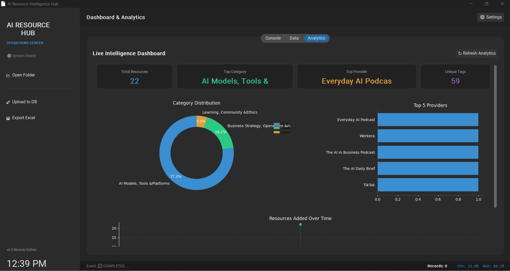
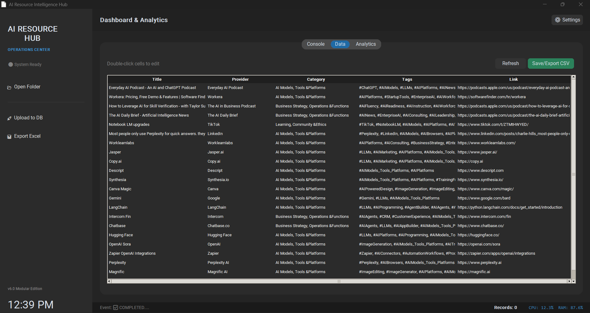
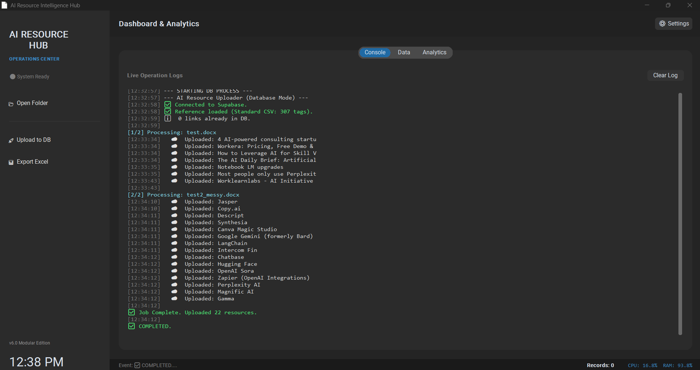

# AI Resource Intelligence Hub (v6.0)

**An advanced automated pipeline for extracting, categorizing, and analyzing AI tools and resources from unstructured documents.**



## 📋 Overview

The **AI Resource Intelligence Hub** is a desktop application built with Python and CustomTkinter. It solves the problem of manually curating AI resources by using **Google Gemini** to read documents (PDF, DOCX, TXT), extract structured metadata, and automatically tag entries based on a strict taxonomy.

It supports dual output modes: **Local CSV** storage for easy Excel analysis and **Supabase** for cloud database integration.

---

## 📸 Interface Preview

### Data Management
View, edit, and export extracted resources. The system automatically categorizes tools based on the `tagging_reference.csv` logic.


### Live Operations Console
Real-time logging of the extraction process, file streaming, and AI processing status.


---

## ✨ Key Features

*   **Intelligent Extraction:** Uses Gemini 2.5 Flash to parse unstructured text and identify tools, descriptions, and providers.
*   **Strict Taxonomy Enforcement:** Uses a `tagging_reference.csv` to map hashtags (e.g., `#ChatGPT`) to specific Categories and Subcategories automatically.
*   **Smart Deduplication:** Checks both the local CSV and the Supabase database to prevent duplicate entries based on URLs.
*   **Resume Capability:** Tracks processed files in `processed_history.log` so you can restart the app without rescanning old files.
*   **Visual Analytics:** Interactive dashboards showing Category Distribution, Top Providers, and Resource Growth over time.

---

## 🛠️ Installation

1.  **Clone the repository**
    ```bash
    git clone https://github.com/yourusername/MAP-AI-resources-hub.git
    cd MAP-AI-resources-hub
    ```

2.  **Install Dependencies**
    ```bash
    pip install -r requirements.txt
    ```

3.  **Configuration Setup**
    The `config.ini` file is excluded from source control for security. You must create it in the root directory:

    **Create a file named `config.ini` and paste this:**
    ```ini
    [API]
    GEMINI_API_KEY=your_google_gemini_key_here
    SUPABASE_KEY=your_supabase_service_role_key_here

    [SETTINGS]
    SUPABASE_URL=your_supabase_url_here
    ```

---

## 🚀 How to Use

1.  **Prepare Inputs:**
    Place your source documents (PDFs, Word Docs, Text files) into the `resources/` folder.

2.  **Launch the App:**
    ```bash
    python main.py
    ```

3.  **Run Extraction:**
    *   Click **"Upload to DB"** to process files and send them to Supabase.
    *   Click **"Export Excel"** (CSV Mode) to process files and save them locally to `data/ai_resources_tagged.csv`.

4.  **Review Data:**
    Go to the **Data** tab to review extracted items. Double-click any cell to edit it manually.

---

## 📂 Project Structure

```text
├── main.py                  # Application Entry Point
├── config.ini               # API Keys (Create this manually)
├── tagging_reference.csv    # The "Brain" - Maps Tags to Categories
├── processed_history.log    # Tracks processed files to avoid duplicates
│
├── app/                     # Source Code
│   ├── core/                # Logic (AI, DataHandler, Streaming)
│   ├── ui/                  # CustomTkinter Interface
│   └── workers/             # Threaded Background Scripts
│
├── data/
│   └── ai_resources_tagged.csv  # Local Output Database
│
├── resources/               # Input Folder (Drop your docs here)
│   ├── test.docx
│   └── ...
│
└── assets/                  # Icons and Readme Images

## Contributing

Contributions welcome! Suggested improvements:
- Add unit tests for `DataHandler` parsing and worker flows
- Add CI (tests, linting, packaging)
- Add a settings toggle for verbose logger UI output

Please open an issue or a PR describing the change.

---

## License

Add a `LICENSE` file to the repo (MIT recommended) and reference it here.

---

Made with ❤️ — keep your `tagging_reference.csv` updated for best results.
